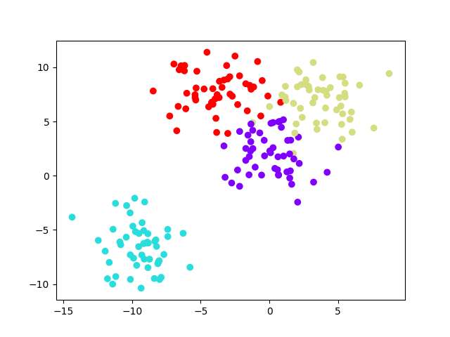

## K-means Algorithm
K-means is a clustering algorithm that's used to classify data into k clusters. It's based on the idea of splitting the data into smaller and smaller subsets while at the same time an associated decision tree is incrementally developed. The final result is a tree with decision nodes and leaf nodes. A decision node (e.g., Outlook) has two or more branches (e.g., Sunny, Overcast, Rainy). Each branch represents a value for the attribute (e.g., Outlook). Leaf node (e.g., Play) represents a class label and contains a summary of the training data that belongs to that class.

The algorithm is as follows:

1. Choose the number of clusters k.
2. Select k random points as cluster centers called centroids.
3. Assign each data point to the closest cluster by calculating its distance to each centroid.
4. Find new cluster center by taking the average of the assigned points.
5. Repeat steps 3 and 4 until none of the cluster assignments change.

### Example

Let's say we have the following data:

| x | y |
|---|---|
| 1 | 1 |
| 1 | 2 |
| 1 | 3 |
| 2 | 1 |
| 2 | 2 |
| 2 | 3 |
| 3 | 1 |
| 3 | 2 |
| 3 | 3 |
| 4 | 1 |
| 4 | 2 |
| 4 | 3 |
| 5 | 1 |
| 5 | 2 |
| 5 | 3 |

We want to classify the data instance (3, 2). We'll use k = 3.

1. Choose the number of clusters k.
2. Select k random points as cluster centers called centroids.
3. Assign each data point to the closest cluster by calculating its distance to each centroid.
4. Find new cluster center by taking the average of the assigned points.
5. Repeat steps 3 and 4 until none of the cluster assignments change.

The first random centroids are:

| x | y |
|---|---|
| 3 | 3 |
| 4 | 2 |
| 2 | 1 |

After the first iteration, the new centroids are:

| x | y |
|---|---|
| 2 | 2 |
| 4 | 2 |
| 1 | 1 |

After the second iteration, the new centroids are:

| x | y |
|---|---|
| 2 | 2 |
| 4 | 2 |
| 1 | 1 |

The algorithm has converged, and the final centroids are:

| x | y |
|---|---|
| 2 | 2 |
| 4 | 2 |
| 1 | 1 |

The data instance (3, 2) belongs to the cluster with the centroid (2, 2).

### Implementation

The K-means algorithm can be implemented in Python. We'll use the following libraries:

```python
import numpy as np
import pandas as pd
import matplotlib.pyplot as plt
from sklearn.datasets import make_blobs
from sklearn.cluster import KMeans
```

We'll use the `make_blobs` function from the `sklearn.datasets` module to create a dataset. The `make_blobs` function creates random clusters of points.

```python
# Create random data
data = make_blobs(n_samples=200, n_features=2, centers=4, cluster_std=1.8, random_state=101)
```

The `data` variable is a tuple with two elements. The first element is an array of the data points and the second element is an array of the labels for the data points.

```python
# Plot the data
plt.scatter(data[0][:,0], data[0][:,1], c=data[1], cmap='rainbow')
plt.show()
```



We'll use the `KMeans` class from the `sklearn.cluster` module to create the K-means model.

```python
# Create the K-means model
kmeans = KMeans(n_clusters=4)
```

We'll use the `fit` method to train the model.

```python
# Train the model
kmeans.fit(data[0])
```

We can use the `cluster_centers_` attribute to get the location of the centroids.

```python
# Get the cluster centers
kmeans.cluster_centers_
```

We can use the `predict` method to predict the cluster for new data points.

```python
# Predict the cluster for new data points
kmeans.predict([[0,0], [4,4]])
```

We can use the `labels_` attribute to get the labels for the training data.

```python
# Get the labels for the training data
kmeans.labels_
```

We can use the `inertia_` attribute to get the sum of squared distances of samples to their closest cluster center.

```python
# Get the sum of squared distances of samples to their closest cluster center
kmeans.inertia_
```

We can use the `score` method to get the opposite of the value of X on the K-means objective.

```python
# Get the opposite of the value of X on the K-means objective
kmeans.score(data[0])
```

We can use the `transform` method to transform X to a cluster-distance space.

```python
# Transform X to a cluster-distance space
kmeans.transform(data[0])
```

We can use the `fit_predict` method to compute cluster centers and predict cluster index for each sample.

```python
# Compute cluster centers and predict cluster index for each sample
kmeans.fit_predict(data[0])
```

We can use the `fit_transform` method to compute cluster centers and transform X to a cluster-distance space.

```python
# Compute cluster centers and transform X to a cluster-distance space
kmeans.fit_transform(data[0])
```

We can use the `get_params` method to get parameters for this estimator.

```python
# Get parameters for this estimator
kmeans.get_params()
```

We can use the `set_params` method to set the parameters of this estimator.

```python
# Set the parameters of this estimator
kmeans.set_params(algorithm='full')
```

We can use the `partial_fit` method to incrementally train with mini-batches.

```python
# Incrementally train with mini-batches
kmeans.partial_fit(data[0])
```

We can use the `n_iter_` attribute to get the number of iterations run.

```python
# Get the number of iterations run
kmeans.n_iter_
```

We can use the `tol` attribute to get the relative tolerance with regards to inertia to declare convergence.

```python
# Get the relative tolerance with regards to inertia to declare convergence
kmeans.tol
```

We can use the `n_clusters` attribute to get the number of clusters.

```python
# Get the number of clusters
kmeans.n_clusters
```

We can use the `n_features_in_` attribute to get the number of features seen during :term:`fit`.

```python
# Get the number of features seen during :term:`fit`
kmeans.n_features_in_
```

We can use the `algorithm` attribute to get the algorithm used to compute the centroids.

```python
# Get the algorithm used to compute the centroids
kmeans.algorithm
```


