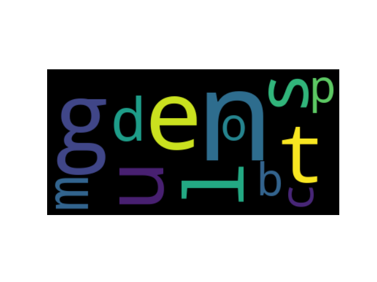
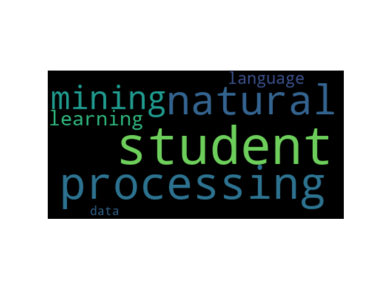
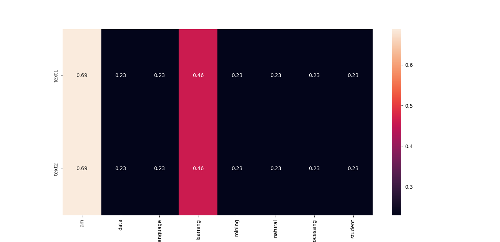

## What's DATA
data is a collection of facts, such as numbers, words, measurements, observations, or even just descriptions of things. Data can be collected from a variety of sources, including paper forms, databases, and sensors. Data can be processed by a computer to produce useful information.

## What's DATA MINING
Data mining is the process of discovering patterns in large data sets involving methods at the intersection of machine learning, statistics, and database systems. Data mining is an interdisciplinary subfield of computer science and statistics with an overall goal to extract information (with intelligent methods) from a data set and transform the information into a comprehensible structure for further use.

## DATA preprocessing
Data preprocessing is a data mining technique that involves transforming raw data into an understandable format. Real-world data is often incomplete, inconsistent, and/or lacking in certain behaviors or trends, and is likely to contain many errors. Data preprocessing is a proven method of resolving such issues.

## how to preprocess data
1. Data Cleaning : remove or replace missing values
2. Data Integration : combine data from multiple sources
3. Data Transformation : normalize, aggregate, bin, discretize, etc.
4. Data Reduction : reduce the size of the data set
5. Data Discretization : discretize continuous attributes

## preprocessing tools
1. Weka
2. RapidMiner
3. KNIME
4. Orange
5. python: pandas, numpy, nltk.

## preprocess text data
1. remove punctuation
2. remove stop words
3. stemming
4. lemmatization

### example
```python
import nltk
from nltk.corpus import stopwords
from nltk.stem import PorterStemmer
from nltk.stem import WordNetLemmatizer
from nltk.tokenize import word_tokenize

# nltk.download('stopwords')
# nltk.download('punkt')
# nltk.download('wordnet')

# remove punctuation
def remove_punctuation(text):
    return ''.join([c for c in text if c not in punctuation])

# remove stop words
def remove_stop_words(text):
    return [word for word in text if word not in stopwords.words('english')]

# stemming
def stemming(text):
    stemmer = PorterStemmer()
    return [stemmer.stem(word) for word in text]

# lemmatization
def lemmatization(text):
    lemmatizer = WordNetLemmatizer()
    return [lemmatizer.lemmatize(word) for word in text]

# preprocess text
def preprocess_text(text):
    text = remove_punctuation(text)
    text = word_tokenize(text)
    text = remove_stop_words(text)
    text = stemming(text)
    text = lemmatization(text)
    return text

text = 'I am a student. I am learning data mining. I am learning natural language processing.'
text = preprocess_text(text)
print(text)
```

now we have a clean text data, we can use it to do some analysis. for example, we can use wordcloud to visualize the most frequent words in the text.

```python
from wordcloud import WordCloud
import matplotlib.pyplot as plt

text = ' '.join(text)
wordcloud = WordCloud().generate(text)
plt.imshow(wordcloud, interpolation='bilinear')
plt.axis("off")
plt.show()
```
the result is:<br>

## use of TF-IDF to extract keywords
TF-IDF is a statistical measure that evaluates how relevant a word is to a document in a collection of documents. The importance increases proportionally to the number of times a word appears in the document but is offset by the frequency of the word in the corpus. TF-IDF is one of the most popular term-weighting schemes today; 83% of text-based recommender systems in digital libraries use TF-IDF.

### example
```python
from sklearn.feature_extraction.text import TfidfVectorizer

text = ['I am a student. I am learning data mining. I am learning natural language processing.',
        'I am a student. I am learning data mining. I am learning natural language processing.']

vectorizer = TfidfVectorizer()
tfidf = vectorizer.fit_transform(text)
print(tfidf.toarray())
print(vectorizer.get_feature_names())
```

now we can plot the tf-idf of each word in the text.

```python
import matplotlib.pyplot as plt
from wordcloud import WordCloud

# creating wordcloud object
wordcloud = WordCloud().generate_from_frequencies(vectorizer.vocabulary_)
# plotting wordcloud
plt.imshow(wordcloud, interpolation='bilinear')
plt.axis("off")
plt.show()
```
the result is:<br>


or we can plot the tf-idf with the help of seaborn.

```python
import seaborn as sns

# plotting heatmap
sns.heatmap(tfidf.toarray(), annot=True, xticklabels=vectorizer.get_feature_names(), yticklabels=['text1', 'text2'])
plt.show()
```
the result is:<br>


## mathematically speaking
### term frequency
the number of times a word appears in a document divided by the total number of words in the document. Every document has its own term frequency.
there are two ways to calculate term frequency:
1. raw term frequency: the number of times a word appears in a document. formula: ![]{https://latex.codecogs.com/gif.latex?tf(t,D)&space;=&space;apperance&space;of&space;term&space;t&space;in&space;document&space;D}
2. normalized term frequency: the number of times a word appears in a document divided by a criteria that we choose. like division by the maximum number of times a word appears in a document. formula: ![]{https://latex.codecogs.com/gif.latex?tf(t,D)&space;=&space;\frac{apperance&space;of&space;term&space;t&space;in&space;document&space;D}{max&space;apperance&space;of&space;any&space;term&space;in&space;document&space;D}}

### inverse document frequency
the logarithm of the number of documents divided by the number of documents that contain the word w. Every word has its own inverse document frequency.
formula: ![]{https://latex.codecogs.com/gif.latex?idf(t,D)&space;=&space;\log&space;\frac{N}{|\{d&space;\in&space;D:&space;t&space;\in&space;d\}|}

### tf-idf
the product of term frequency and inverse document frequency. Every word has its own tf-idf.
formula: ![]{https://latex.codecogs.com/gif.latex?tfidf(t,d,D)&space;=&space;tf(t,d)&space;\times&space;idf(t,D)}
