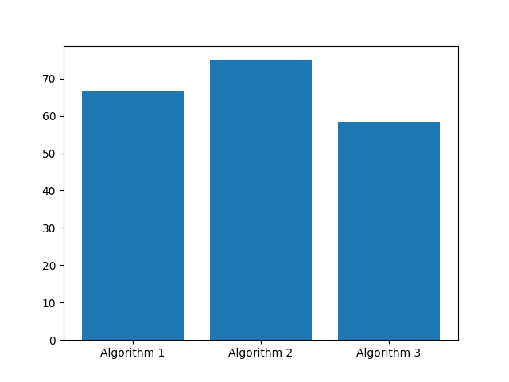

## Evaluation of a DATA MINING Algorithm
is a process of comparing the performance of a DATA MINING algorithm by calculating the  accuracy of the algorithm on a given dataset. The accuracy is calculated by comparing the predicted values of the algorithm with the actual values of the dataset. The accuracy is calculated by using the following formula:
```math
Accuracy=\frac{TP+TN}{TP+TN+FP+FN}
```
where:
- TP is the number of true positives
- TN is the number of true negatives
- FP is the number of false positives
- FN is the number of false negatives

also we can calculate the precision of the algorithm by using the following formula:
```math
Precision=\frac{TP}{TP+FP}
```
and the recall of the algorithm by using the following formula:
```math
Recall=\frac{TP}{TP+FN}
```
### Example
Let's say we had the following results from a DATA MINING algorithm:


| Actual | Predicted |
|--------|-----------|
| 1      | 1         |
| 1      | 1         |
| 1      | 0         |
| 0      | 1         |
| 0      | 0         |
| 0      | 0         |
| 2      | 2         |
| 2      | 2         |
| 2      | 1         |
| 3      | 2         |
| 3      | 3         |
| 3      | 3         |

The accuracy is calculated as follows:

```math
Accuracy=\frac{4+4}{4+4+2+2}=0.67
```

The accuracy of the algorithm is 67%.

the precision is calculated as follows:

```math
Precision=\frac{4}{4+2}=0.67
```

The precision of the algorithm is 67%.

the recall is calculated as follows:

```math
Recall=\frac{4}{4+2}=0.67
```

The recall of the algorithm is 67%.
### Implementation

```python	
def accuracy(actual, predicted):
    correct = 0
    for i in range(len(actual)):
        if actual[i] == predicted[i]:
            correct += 1
    return correct / float(len(actual)) * 100.0
```

result is:

```python
actual = [1, 1, 1, 0, 0, 0, 2, 2, 2, 3, 3, 3]
predicted = [1, 1, 0, 1, 0, 0, 2, 2, 1, 2, 3, 3]
accuracy = accuracy(actual, predicted)
print('Accuracy: %.2f%%' % accuracy)
```

result is:

```python
Accuracy: 66.67%
```

we can compare the accuracy of more than one algorithm by just changing the predicted values of the algorithm. and plot the results in a graph to see which algorithm is better.

### Example

```python
def accuracy(actual, predicted):
    correct = 0
    for i in range(len(actual)):
        if actual[i] == predicted[i]:
            correct += 1
    return correct / float(len(actual)) * 100.0

actual = [1, 1, 1, 0, 0, 0, 2, 2, 2, 3, 3, 3]

predicted1 = [1, 1, 0, 1, 0, 0, 2, 2, 1, 2, 3, 3]
accuracy1 = accuracy(actual, predicted1)

predicted2 = [1, 1, 0, 1, 0, 0, 2, 2, 1, 3, 3, 3]
accuracy2 = accuracy(actual, predicted2)

predicted3 = [1, 1, 0, 1, 0, 0, 2, 2, 1, 3, 3, 2]
accuracy3 = accuracy(actual, predicted3)

print('Accuracy1: %.2f%%' % accuracy1)
print('Accuracy2: %.2f%%' % accuracy2)
print('Accuracy3: %.2f%%' % accuracy3)

import matplotlib.pyplot as plt

plt.plot(['Algorithm1', 'Algorithm2', 'Algorithm3'], [accuracy1, accuracy2, accuracy3])
plt.show()
```

result is:

```python
Accuracy1: 66.67%
Accuracy2: 75.00%
Accuracy3: 58.33%
```


